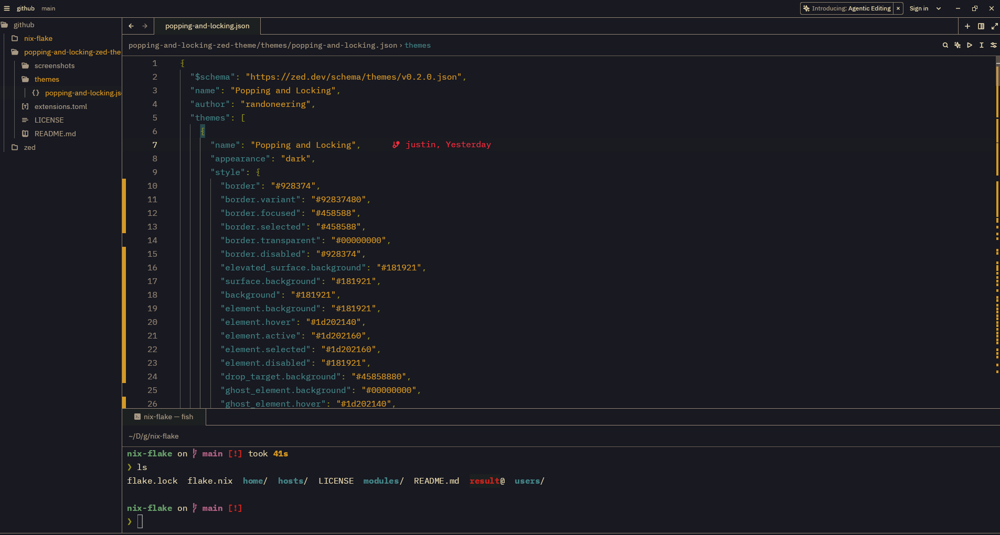
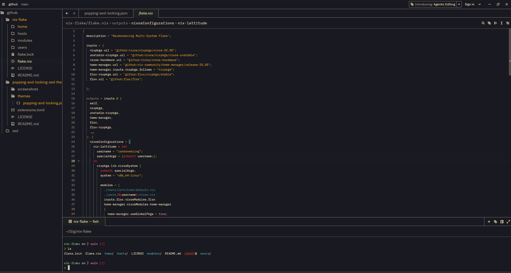

# popping-and-locking-zed-theme
This is my attempt at porting the 'popping and locking' theme used in iTerm2, ghostty, atom, vscode, and other tools. I will always consider this a work in progress and I am happy to have anyone jump in and propose adjustments to the color settings!

## Screenshots

## ASNI Color Palette
|Color|ANSI|
|----|------|
|Black|#1d2021|
|Red|#cc241d|
|Green|#98971a|
|Yellow|#d79921|
|Blue|#458588|
|Magenta|#b16286|
|Cyan|#689d6a|
|White|#a89984|
|Bright Black|#928374|
|Bright Red|#f42c3e|
|Bright Green|#b8bb26|
|Bright Yellow|#fabd2f|
|Bright Blue|#99c6ca|
|Bright Magenta|#d3869b|
|Bright Cyan|#7ec16e|
|Bright White|#ebdbb2|
